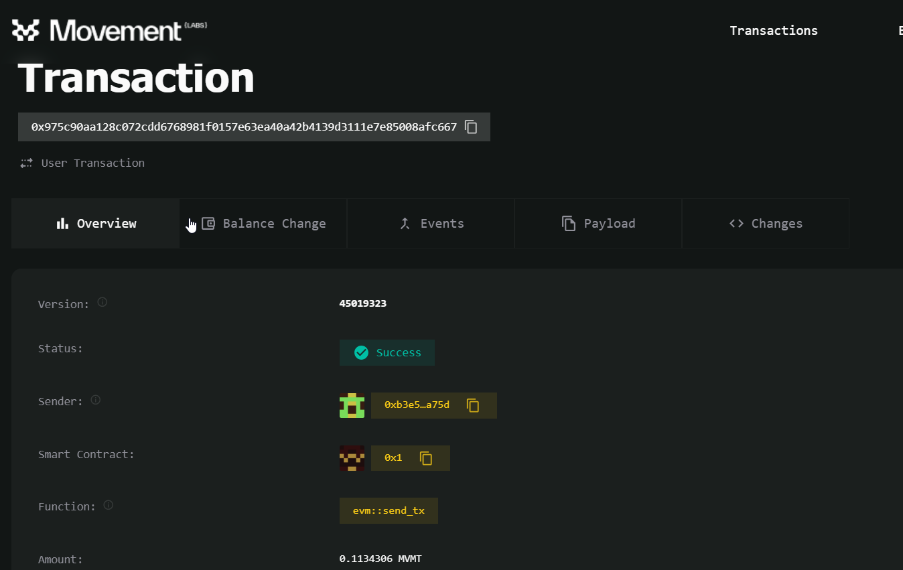

# Project Tutorial: Implementing EVM Runtime on MOVE

> **Warning:** The current version of move-emv is in development and unstable. Documentation is frequently updated, and we strive to keep it current. If you find the RPC service unavailable at times, it may be due to ongoing upgrades or fixes. Thank you for your understanding.

This project demonstrates how to:

- Use the [EVM runtime](https://github.com/movemntdev/movement-v2/blob/main/aptos-move/framework/aptos-framework/sources/evm/evm.move) on the Movement Subnet.
- Implement partial Ethereum RPC methods to interact with Solidity contracts using MetaMask and Remix.
- Deploy Solidity contracts using Remix.
- Perform read and write operations on contracts.

## Public RPC

- **Move EVM RPC:** [https://mevm.devnet.m1.movementlabs.xyz](https://mevm.devnet.m1.movementlabs.xyz)
- **Explorer:** [https://explorer.movementlabs.xyz/](https://explorer.movementlabs.xyz/)

## Implemented EVM RPC Methods

The following RPC methods have been implemented to ensure interaction with Solidity contracts using MetaMask and Remix:

- `net_version`: Get the version number. (Returns a fixed value for EVM compatibility)
- `web3_clientVersion`: Returns the current client version. (Returns a fixed value for EVM compatibility)
- `eth_feeHistory`: Returns the gas fee history. (Returns a fixed value for EVM compatibility)
- `eth_chainId`: Get the chain ID, currently fixed at 336.
- `eth_gasPrice`: Get the current gas price.
- `eth_blockNumber`: Get the latest block number.
- `eth_sendRawTransaction`: Send signed raw transaction data. This checks the correctness of the signature.
- `eth_call`: Invoke methods of smart contracts.
- `eth_getTransactionCount`: Get the transaction count for a specific address.
- `eth_getTransactionByHash`: Get transaction information based on the transaction hash.
- `eth_getTransactionReceipt`: Get the transaction receipt based on the transaction hash.
- `eth_estimateGas`: Estimate the gas consumption for a transaction. If the gas is less than 21,000 for successful transactions, it returns 21,000. However, the actual consumed gas is used when sending the transaction. If the gas is 1,000,000, it indicates that the transaction will fail.
- `eth_getBlockByNumber`: Get block information based on the block number.
- `eth_getBlockByHash`: Get block information based on the block hash.
- `eth_getBlockReceipts`: Get the receipts of transactions in a block.
- `eth_getCode`: Get the smart contract code at a specific address.
- `eth_getBalance`: Get the balance of an address.
- `eth_getStorageAt`: Get the storage data at a specific position of an address.

### New Rpc for Move Evm

1. `debug_getMoveHash`:Return the move hash by evm hash, this could use for query transaction details at move explorer

```bash
curl --location 'https://mevm.devnet.m1.movementlabs.xyz' \
--header 'Content-Type: application/json' \
--data '{
    "id": "1",
    "jsonrpc": "2.0",
    "method": "debug_getMoveHash",
    "params": [
        "0xe6bff6208586ca14cd0e22ff6a2cfde4b36c4d26526609296c62d991ce368105"
    ]
}'
```

* Then you will get the move hash

```json
{
  "jsonrpc": "2.0",
  "id": "1",
  "result": "0x975c90aa128c072cdd6768981f0157e63ea40a42b4139d3111e7e85008afc667"
}
```

* If the transaction is successful, it will find its hash in the move explorer, which you can click to see the details of the transaction


`Overview` display the status of the transaction and the use of gas



`Balance Change` display change of native token in this transaction


` Events ` display list of trigger Events in the transaction, for the evm contracts issued by the original log data, the type of `0x1::evm::Log0Event, 0x1::evm::Log1Event, 0x1::evm::Log2Event, 0x1::evm::Log3Event, 0x1::evm entry::Log3Event`, you can use the `eth_getTransactionReceipt` get the parsed evm forms of logs


`Payload` displays the on-chain data sent in this transaction, similar to eth_sendRawTransaction


2. `debug_getMoveAddress`: Return the evm address map to move address, this could use for query account details at move explorer

```bash
curl --location 'https://mevm.devnet.m1.movementlabs.xyz' \
--header 'Content-Type: application/json' \
--data '{
    "id": "1",
    "jsonrpc": "2.0",
    "method": "debug_getMoveAddress",
    "params": [
        "0xB8f7166496996A7da21cF1f1b04d9B3E26a3d077"
    ]
}'
```

- Then you will get the corresponding move address

```json
    {
        "jsonrpc": "2.0",
        "id": "1",
        "result": "0x5f8a9bd40f4abefc2994a13a8f1f952cd8de75215f459d510547196c37c47b0b"
    }
```

- Click the details of this account in your browser


* `Resources` displays the account info, include evm account `nonce`, `balance`, `code`


### Add RPC to MetaMask

1. Open MetaMask 


2. Go to settings


3. Go to network settings 


4. Add a network 


5. Add network information 


### Connect MetaMask to Remix and Interact with Contracts

1. Open [Remix IDE](http://remix.ethereum.org/), and open the built-in _Storage_ contract  


2. Compile the contract


3. Deploy the contract (make sure to select the network environment provided by MetaMask). After successful deployment, the contract address will appear in the bottom left corner for interaction.


4. Interact with the contract


### Possible Issues

- If you are using MetaMask to send transactions and a transaction fails, please follow these steps to clear the transaction history and retry. This is because the nonce does not change when an EVM transaction fails, and MetaMask will increment by default instead of fetching the latest nonce.
  - Go to Settings
  - Navigate to Advanced
  - Click on Clear Activity Tab Data
  - Confirm by clicking Clear
