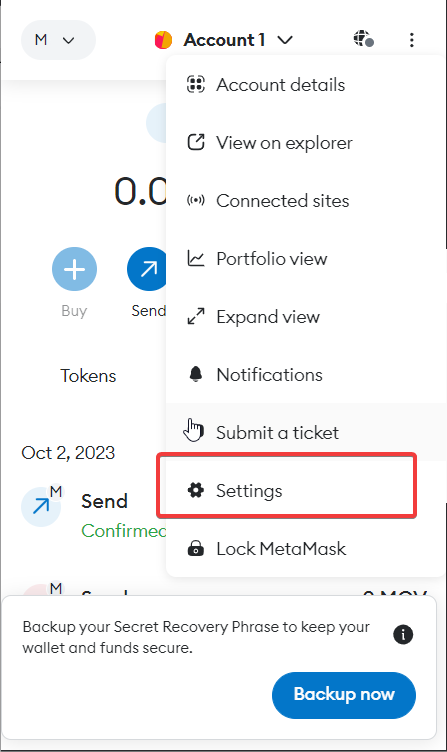
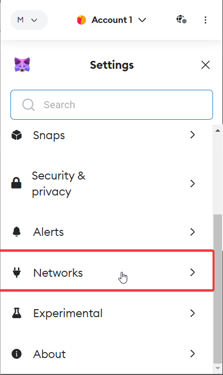
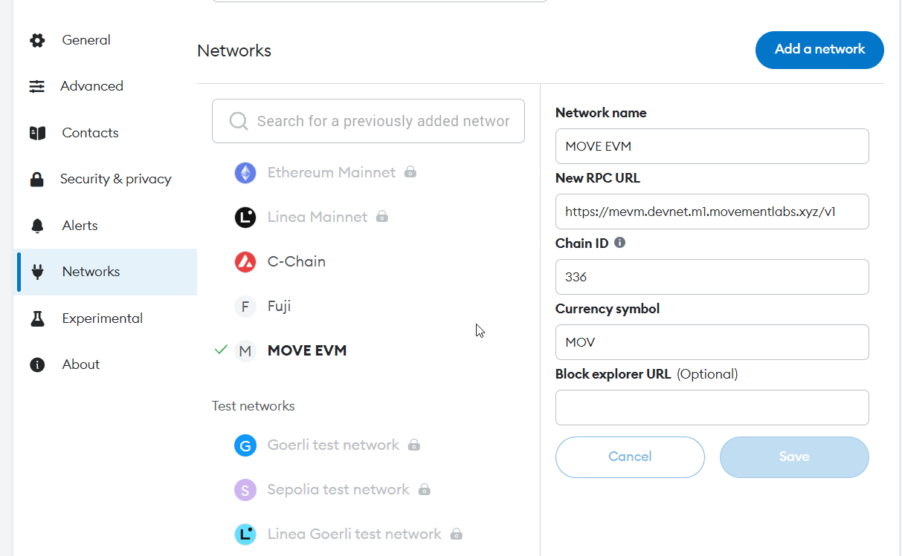
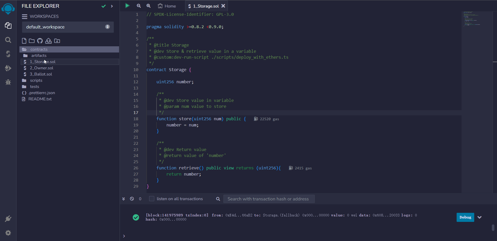
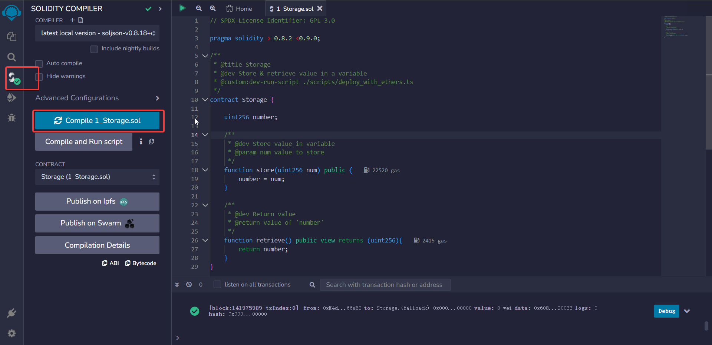

## Project Tutorial: Implementing EVM Runtime on MOVE

This project demonstrates how to:

- Call with [EVM runtime](../../aptos-move/framework/aptos-framework/sources/evm/evm.move) on Movement EVM.
- Implement partial Ethereum RPC methods to interact with Solidity contracts using MetaMask and Remix.
- Deploy Solidity contracts using Remix.
- Perform contract read and write operations.

### Requirement

>Running [evm indexer](../evm-indexer/) firstly

### Implemented RPC Methods

The following RPC methods have been implemented to ensure interaction with Solidity contracts using MetaMask and Remix:

- `eth_chainId`: Get the chain ID.
- `net_version`: Returns fixed value for meet ETH network rpc requirement.
- `eth_gasPrice`: Get the current gas price.
- `eth_blockNumber`: Get the latest block number. Updated every 2 seconds.
- `eth_sendRawTransaction`: Send signed raw transaction data. This checks the correctness of the signature.
- `eth_call`: Invoke methods of smart contracts.
- `eth_getTransactionCount`: Get the transaction count for a specific address.
- `eth_getTransactionByHash`: Get transaction information based on the transaction hash.
- `eth_getTransactionReceipt`: Get the transaction receipt based on the transaction hash.
- `eth_estimateGas`: Estimate the gas consumption for a transaction.
- `eth_getBlockByNumber`: Get block information based on the block number.
- `eth_getBlockByHash`: Get block information based on the block hash.
- `eth_getBalance`: Get the balance of a specific address
- `eth_getCode`: Get the code of a specific contract address.
- `eth_getStorageAt`: Get the storage at a specific position in a specific address
- `eth_getLogs`: Returns an array of all logs matching a given filter object.
- `web3_clientVersion`: Returns the current client version.
- `eth_feeHistory`: Returns fixed value for meet eip1159 requirement.


### New Rpc for Move Evm

- `eth_faucet`: For get test token, only NODE_ENV not production is validate

```bash
curl --location 'http://127.0.0.1:8998' \
--header 'Content-Type: application/json' \
--data '{
    "id": "1",
    "jsonrpc": "2.0",
    "method": "eth_faucet",
    "params": [
        "0xB8f7166496996A7da21cF1f1b04d9B3E26a3d077"
    ]
}'
```

- `debug_getMoveHash`:Return the move evm hash by evm hash, this could use for query details at move explorer

```bash
curl --location 'http://127.0.0.1:8998' \
--header 'Content-Type: application/json' \
--data '{
    "id": "1",
    "jsonrpc": "2.0",
    "method": "debug_getMoveHash",
    "params": [
        "0x3dc7fc5be27c5a5f92d35590ebe2a671ca0e98c22aeb09e3036ae94b6fedf81a"
    ]
}'
```

- `eth_batch_faucet`: use google recaptcha to protect to faucet token,to use this function

```bash
curl --location 'http://127.0.0.1:8998' \
--header 'Content-Type: application/json' \
--data '{
    "id": "1",
    "jsonrpc": "2.0",
    "method": "eth_batch_faucet",
    "params": [
        "0xB8f7166496996A7da21cF1f1b04d9B3E26a3d077"
    ]
}'
```

### Start Your EVM RPC

- Set environment variables

```bash
cp .env.example .env
```

```bash
npm 
npm run start

# This will start a server on port 8998
```

### Add RPC to MetaMask

1. Open MetaMask 
2. Go to settings 
3. Go to network settings 
4. Add a network 
5. Add network information (if it's local development, replace RPC with <http://127.0.0.1:8999>) 

### Connect MetaMask to Remix and Interact with Contracts

1. Open [Remix IDE](http://remix.ethereum.org/), and open the built-in _Storage_ contract 
2. Compile the contract 
3. Deploy the contract (make sure to select the network environment provided by MetaMask). After successful deployment, the contract address will appear in the bottom left corner for interaction.

4. Interact with the contract

### Possible Issues

- If you are using MetaMask to send transactions and a transaction fails, please follow these steps to clear the transaction history and retry. This is because the nonce does not change when an EVM transaction fails, and MetaMask will increment by default instead of fetching the latest nonce.
  - Go to Settings
  - Navigate to Advanced
  - Click on Clear Activity Tab Data
  - Confirm by clicking Clear
